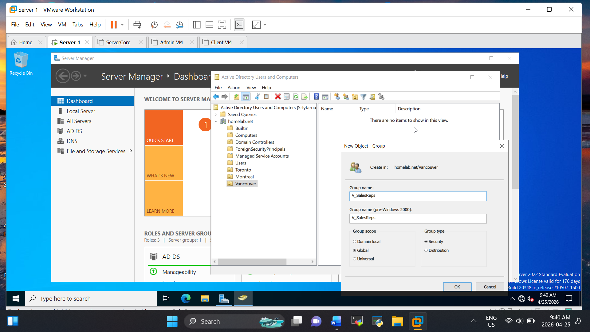
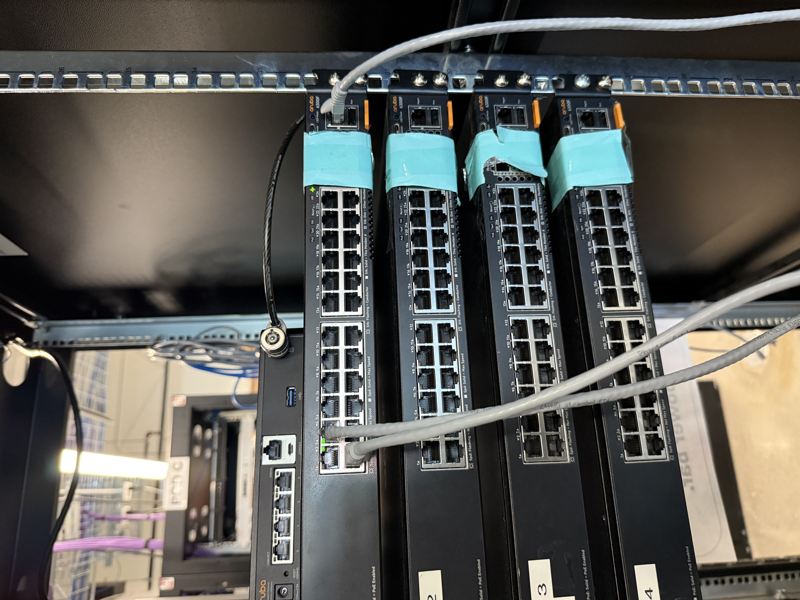

# 👋 Hi, I'm Tarnagda

# 🏠 Home Lab Portfolio – IT Infrastructure & Security

## 👨‍💻 About Me

I am an entry level IT professional with a strong interest in systems administration, networking, and cybersecurity.
This repository showcases hands on lab projects where I design, build, and troubleshoot real world IT environments using industry standard tools and platforms.

---

## 🧠 Key Skills Demonstrated

* Windows Server Administration (Active Directory, DNS, DHCP)
* Identity & Access Management (Microsoft Entra ID, MFA)
* Device Management (Microsoft Intune, MDM)
* IT Troubleshooting & Support
* Networking (VLANs, OSPF, NAT, ACLs)
* Cloud Computing (AWS & Azure)
* Linux System Administration
* Scripting & Automation (PowerShell, Bash, Python)
* Virtualization (VMware, VirtualBox)

---

## 🧰 Featured Projects

### 🔹 Active Directory Domain Lab

**Objective:** Build and manage a Windows Server domain environment

**What I Did:**

* Installed Windows Server and configured it as a Domain Controller
* Created Organizational Units (OUs), users, and groups
* Configured Group Policy Objects (GPOs)
* Joined a Windows 10 client to the domain
* Tested authentication and access control

### 📸 Preview

📂 [View Full Project](windows-server-ad/README.md)

---

### 🔹 Identity & Device Management Lab (Intune + Entra ID)

**Objective:** Implement cloud-based identity, access control, and device management

**What I Did:**

* Configured users and groups in Microsoft Entra ID
* Enabled Multi-Factor Authentication (MFA)
* Enrolled devices into Microsoft Intune (MDM)
* Applied device compliance and security policies
* Tested secure login and Conditional Access

### 📸 Preview

📂 [View Full Project](intune-entra-lab/README.md)

---

### 🔹 IT Support & Ticketing Lab (ServiceNow)

**Objective:** Simulate real-world help desk and IT support scenarios

**What I Did:**

* Resolved user login and Active Directory permission issues
* Troubleshot printer and network connectivity issues
* Worked with common user support requests
* Documented ticket lifecycle and resolution steps

### 📸 Preview

📂 [View Full Project](helpdesk-lab/README.md)

---

### 🔹 Networking Lab (VLANs & Routing)

**Objective:** Simulate a segmented enterprise network

**What I Did:**

* Configured VLANs and inter-VLAN routing
* Implemented OSPF routing
* Applied NAT and Access Control Lists (ACLs)
* Tested connectivity between subnets

### 📸 Preview

📂 [View Full Project](networking-lab/README.md)

---

### 🔹 AWS Cloud Infrastructure Lab

**Objective:** Deploy and secure cloud-based infrastructure

**What I Did:**

* Created a VPC with public and private subnets
* Launched and configured EC2 instances
* Configured Security Groups and NACLs
* Attached and managed EBS volumes

### 📸 Preview

📂 [View Full Project](aws-lab/README.md)

---

### 🔹 Scripting & Automation

**PowerShell:**

* Automated Active Directory user creation
* Managed file permissions

**Bash:**

* Automated system updates and user management

**Python:**

* Built CLI tools for file handling

### 📸 Preview

📂 [View Full Project](scripting-automation/README.md)

---

## 🧪 Tools & Technologies

* Windows Server 2019/2022
* Linux (Ubuntu / CentOS)
* Microsoft Entra ID
* Microsoft Intune (MDM)
* ServiceNow
* AWS & Microsoft Azure
* VMware / VirtualBox
* PowerShell, Bash, Python

---

## 📌 Goal

To continuously improve my skills through hands-on projects in system administration, cloud computing, automation, and DevOps.

---
