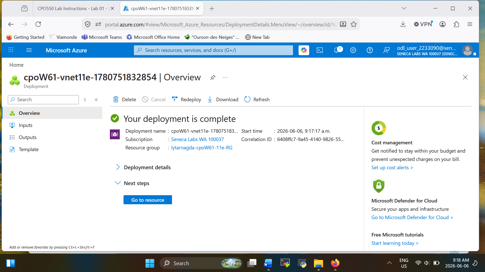
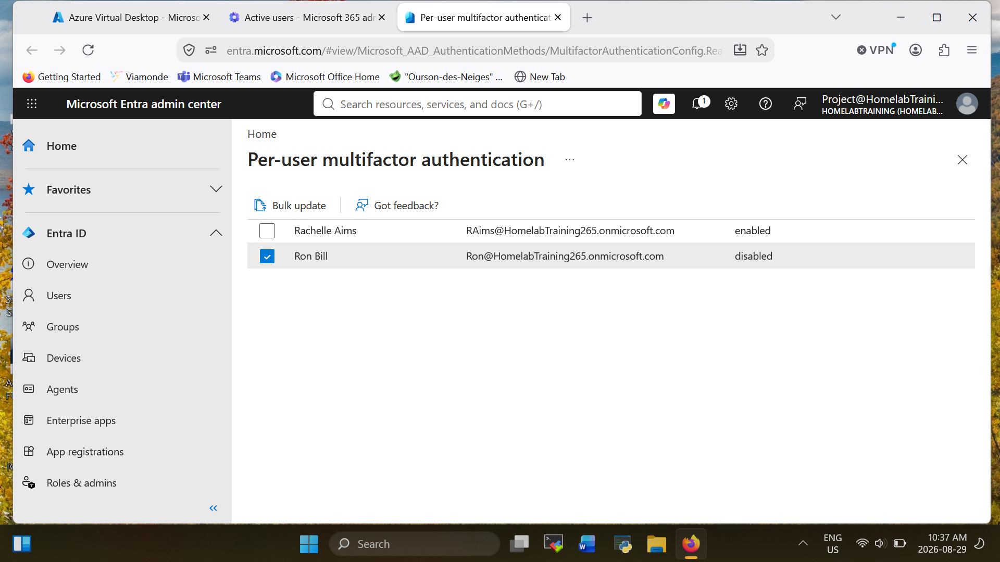
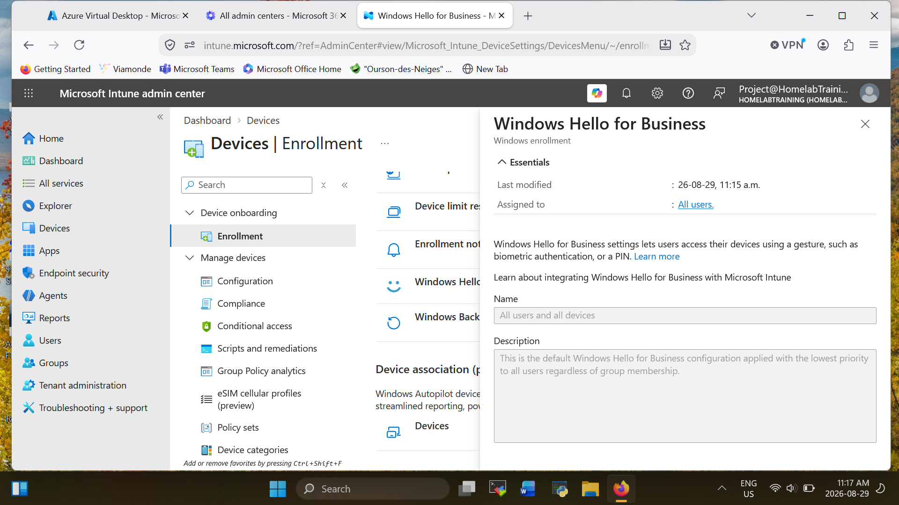

# 🔐 Microsoft Entra ID & Intune Lab

## 🎯 Objective

The goal of this lab was to practice managing users, securing accounts, and managing a Windows device using Microsoft Entra ID and Intune.

---

## 🧱 Lab Environment

| Component | Details |
| ---------- | ------- |
| Identity | Microsoft Entra ID |
| Device Management | Microsoft Intune |
| Client | Windows 11 |
| Authentication | MFA |
| Device Enrollment | Intune MDM |

---

## ⚙️ Lab Setup

### 1. Entra ID Users and Groups

* Created test user accounts in Microsoft Entra ID
* Created groups and added users as members
* Used groups to organize users and assign access

.png)

---

### 2. Multi-Factor Authentication (MFA)

* Enabled MFA for the test account
* Signed in with the account to verify that additional authentication was required

---

### 3. Windows Device Enrollment

* Connected a Windows 11 machine to the organization
* Enrolled the device in Microsoft Intune
* Checked Intune to make sure the device was successfully registered and managed

---

### 4. Device Compliance Policy

* Created a compliance policy for the Windows device
* Assigned the policy to the test users/devices
* Checked the device compliance status in Intune

---

### 5. Device Configuration

* Created configuration settings for the Windows device
* Assigned the policy through Intune
* Checked the device to make sure the settings were applied

---

### 6. Conditional Access

* Created a Conditional Access policy for the test users
* Added authentication and device requirements
* Tested the policy by signing in with a test account

---

## 🔍 Testing

After completing the configuration, I checked that:

* The Windows 11 device appeared in Intune
* The device showed the expected compliance status
* MFA was required during sign-in
* Assigned Intune policies were applied to the device
* The test user could sign in based on the configured access policies

---

## 🧠 Skills Practiced

* Microsoft Entra ID
* Microsoft Intune
* User and Group Management
* Multi-Factor Authentication
* Device Enrollment
* Compliance Policies
* Conditional Access
* Troubleshooting

---

## 🚀 What I Learned

This lab gave me hands-on practice with managing users and Windows devices in a Microsoft cloud environment. I also learned how Entra ID and Intune work together to control user access, device compliance, and security policies.
