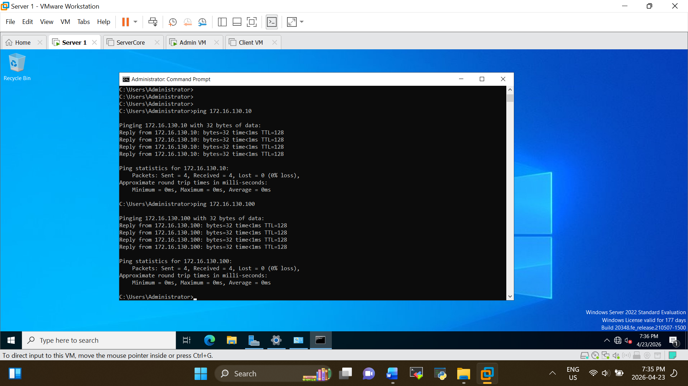
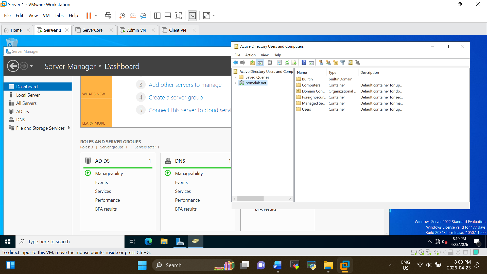
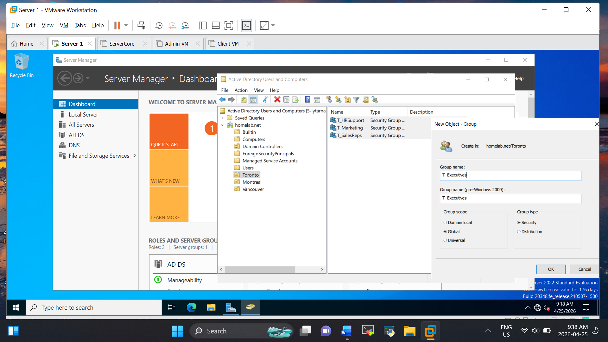
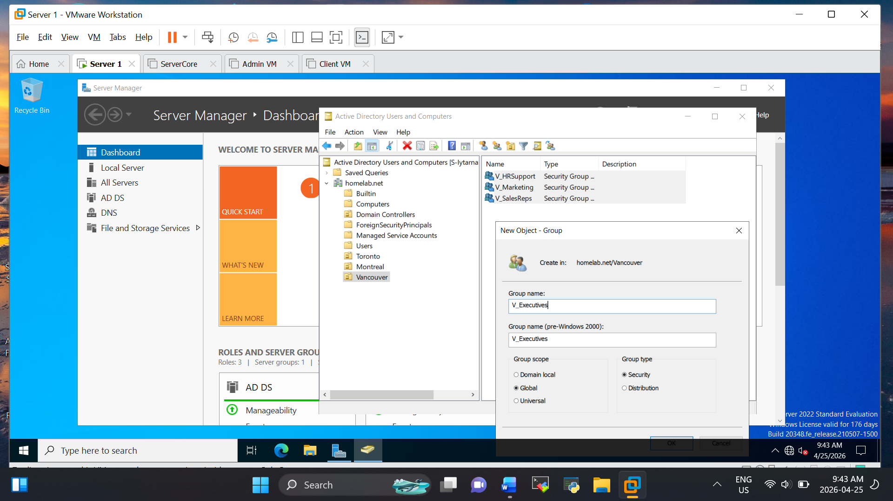
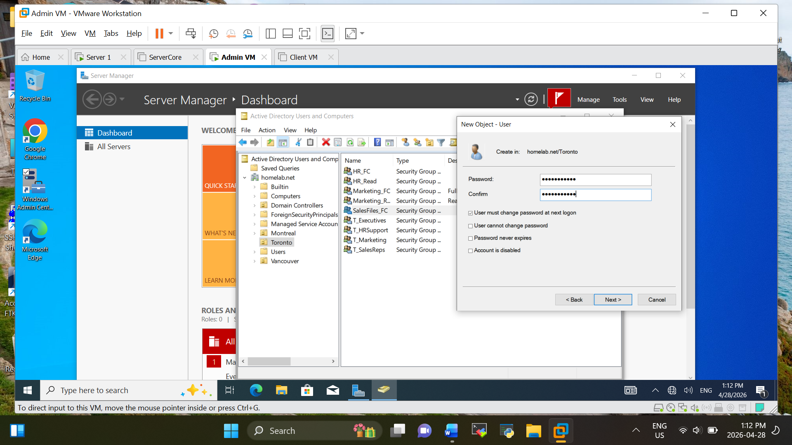
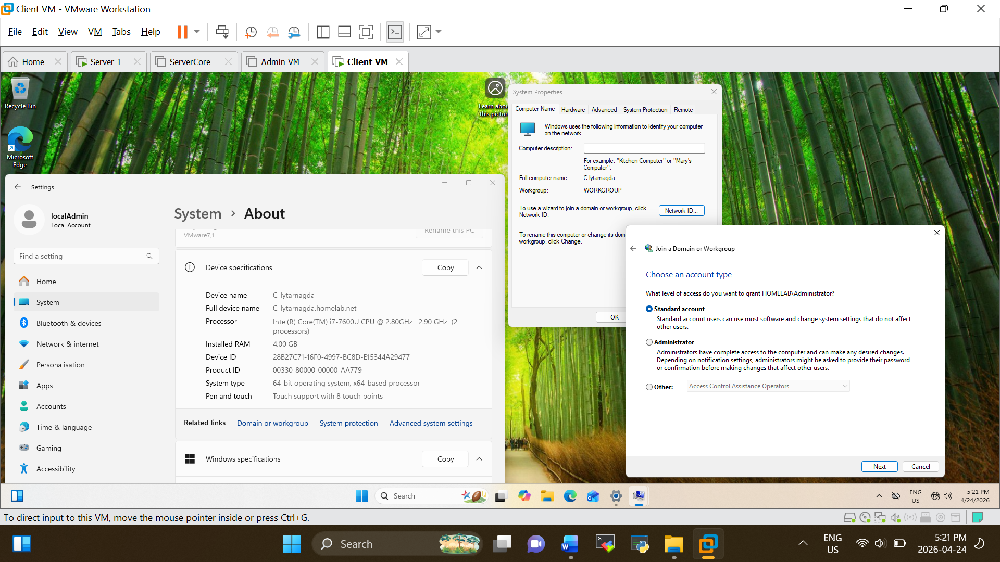

# 🔐 Active Directory Domain Lab

## 📌 Objective

The goal of this project is to design and implement a Windows Server Active Directory environment, simulating a real-world enterprise setup with centralized user management, security policies, and domain-based authentication.

---

## 🧱 Lab Environment

| Component  | Details              |
| ---------- | -------------------- |
| Hypervisor | VMware / VirtualBox  |
| Server OS  | Windows Server 2022  |
| Client OS  | Windows 11           |
| Network    | Internal Lab Network |

---

## 🖥️ Network Design

* Domain Controller: 172.16.130.10
* ServerCore: 172.16.130.20
* Admin VM: 172.16.130.100
* Client Machine: 172.16.130.101

---

## ⚙️ Implementation Steps

### 1. Install Windows Server

* Installed Windows Server 2022 on a virtual machine
* Configured a static IP address

---

### 2. Configure Active Directory Domain Services (AD DS)

* Installed the AD DS role
* Promoted the server to Domain Controller
* Created domain: `homelab.net`

---

### 3. Create Organizational Units (OUs)

Created Organizational Units for:

* Toronto
* Montreal
* Vancouver

---

### 4. User & Group Management

* Created users for each department
* Assigned users to Global Security Groups

---

### 5. Group Policy Configuration (GPO)

Implemented the following policies:

* Enforced password complexity
* Disabled USB storage access
* Configured desktop restrictions

---

### 6. Join Client to Domain

* Connected Windows 11 client to the `homelab.net` domain
* Verified domain login functionality

---

## 🔍 Testing & Validation

* Successfully logged in as domain users
* Verified GPO policies applied correctly
* Tested access restrictions between departments

---

## 🧠 Skills Demonstrated

* Active Directory Administration
* Group Policy Management
* Windows Server Configuration
* Troubleshooting & Issue Resolution

---

## 🚀 Key Takeaways

This project demonstrates my ability to deploy and manage a centralized identity system, enforce security policies, and troubleshoot common issues in a Windows Server environment.

---
